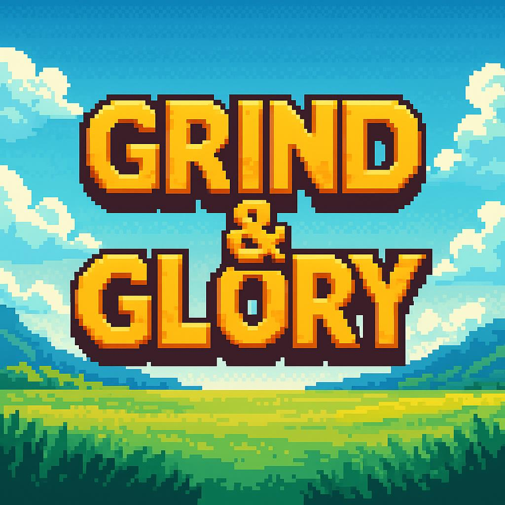

  

# GNG – Grind & Glory

*Telegram pixel RPG where RNG reigns, fuses explode, and only true grinders earn GNG.*

---

  

---

🎮 *What is GNG?*

GNG (Grind & Glory) is a Telegram-based pixel RPG that fuses addictive gameplay with real crypto earning potential via the TON blockchain.

Players complete quests, collect XP, earn gold, unlock chests, upgrade characters, and gain passive income. TON token is used for purchasing boosts, premium features, and rerolling classes.

---

