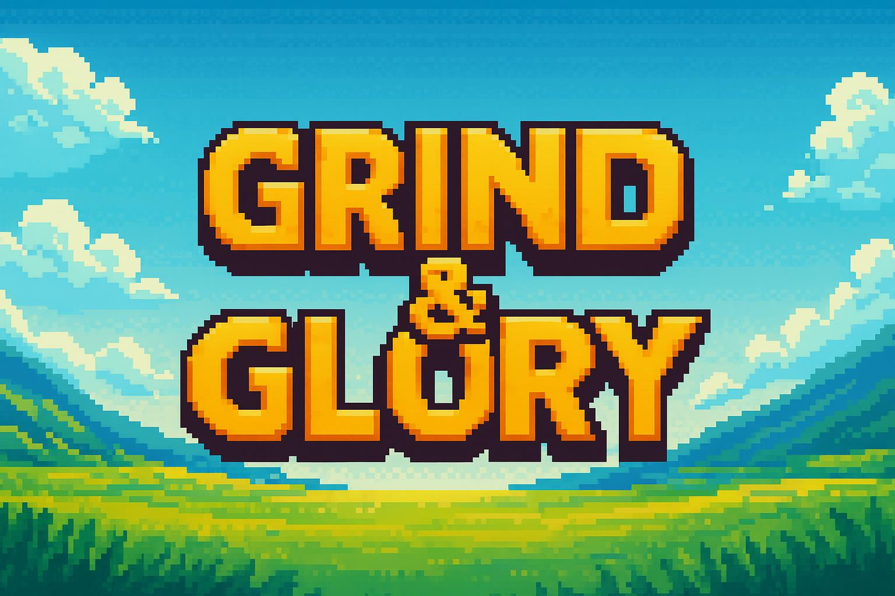

<p align="center">
  
</p>

# GNG – Grind & Glory

*Telegram pixel RPG where RNG reigns, fuses explode, and only true grinders earn GNG.*

---

📜 *Whitepaper:*  
[📄 Open GNG – Whitepaper (PDF)](./GNG%20–%20whitepaper.pdf)

---

🎮 *What is GNG?*

GNG (Grind & Glory) is a Telegram-based pixel RPG that fuses addictive gameplay with real crypto earning potential via the TON blockchain.

Players complete quests, collect XP, earn gold, unlock chests, upgrade characters, and gain passive income. TON token is used for purchasing boosts, premium features, and rerolling classes.

---

🧙 *Classes:*

- *Warrior* – Tanky brute force, gets bonus gold from battles  
- *Mage* – Spell-based nukes, extra XP gain  
- *Rogue* – Sneaky crits and higher item drop rate  

---

🗝 *Key Commands:*

```text
/start       – enter the game & choose a class
/quest       – daily quest with random rewards
/inventory   – view collected items & boosts
/shop        – buy chests or boosts
/reroll      – switch class (costs TON)
/fuse        – upgrade items
/stats       – view your level & progress
/referral    – invite friends & earn rewards
